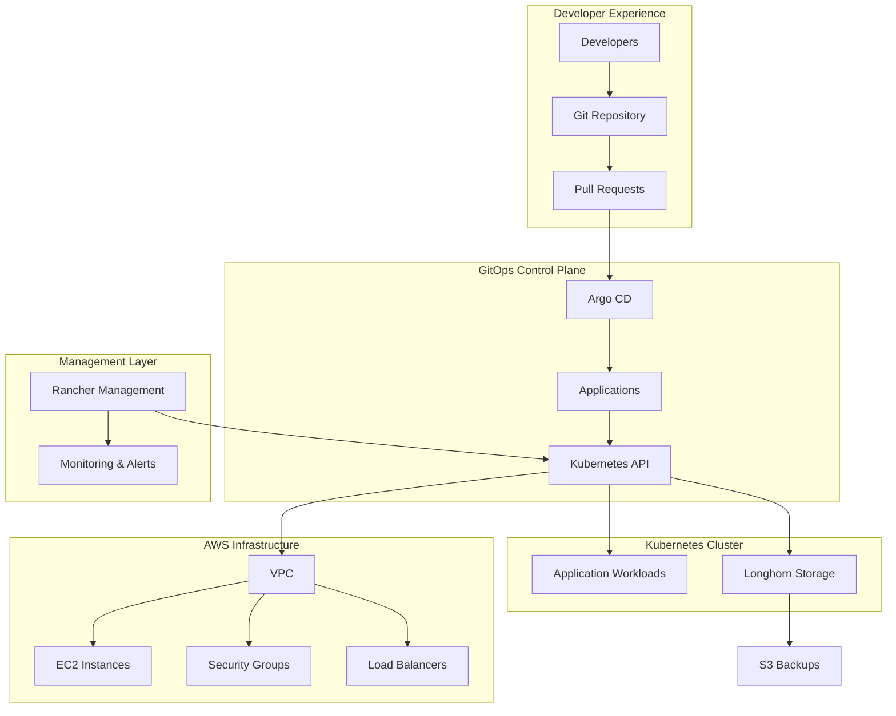

# 🚀 Kubernetes Platform Engineering with Rancher & GitOps

[](https://opensource.org/licenses/MIT)
[](https://terraform.io/)
[](https://kubernetes.io/)
[](https://aws.amazon.com/)
[](https://rancher.com/)
[](https://argoproj.github.io/cd/)

> **A production-ready Kubernetes platform implementation showcasing modern platform engineering practices, GitOps workflows, and cloud-native storage solutions.**

This repository demonstrates the complete journey from infrastructure provisioning to application deployment using industry-standard tools and practices that scale from development to enterprise production environments.

## 📋 Table of Contents

- [🎯 Project Overview](#-project-overview)
- [🏗️ Architecture](#️-architecture)
- [🚀 Quick Start](#-quick-start)
- [📁 Project Structure](#-project-structure)
- [🔧 Implementation Guide](#-implementation-guide)
- [🛡️ Security](#️-security)
- [📊 Monitoring & Observability](#-monitoring--observability)
- [🔄 GitOps Workflows](#-gitops-workflows)
- [💾 Storage Management](#-storage-management)
- [🧪 Testing & Validation](#-testing--validation)
- [📚 Documentation](#-documentation)
- [🤝 Contributing](#-contributing)
- [📄 License](#-license)

---

## 🎯 Project Overview

### The Challenge
Building a production-ready Kubernetes platform involves numerous complex decisions around:
- **Cluster Management** - Simplified operations without losing control
- **GitOps Implementation** - Declarative deployments with audit trails
- **Storage Solutions** - Persistent, replicated storage for stateful applications
- **Security Posture** - Zero-trust networking and RBAC implementation
- **Operational Excellence** - Monitoring, logging, and incident response

### The Solution
This implementation provides a complete platform using:

| Component | Purpose | Benefits |
|-----------|---------|----------|
| **[Rancher](https://rancher.com/)** | Kubernetes Management Platform | Unified cluster operations, built-in security, multi-cluster ready |
| **[Argo CD](https://argoproj.github.io/cd/)** | GitOps Continuous Delivery | Declarative deployments, automatic drift detection, rollback capabilities |
| **[Longhorn](https://longhorn.io/)** | Cloud-Native Storage | Distributed block storage, automatic replication, backup integration |
| **[Terraform](https://terraform.io/)** | Infrastructure as Code | Reproducible infrastructure, version-controlled changes |
| **AWS** | Cloud Infrastructure | Reliable foundation with managed services integration |

### Key Outcomes
- ✅ **Operational Simplicity** - Single interface for all cluster operations
- ✅ **GitOps-First** - All changes tracked and auditable through Git
- ✅ **Storage Resilience** - Automated 3-way replication across availability zones
- ✅ **Security Baseline** - Network policies, RBAC, and encrypted communications
- ✅ **Production Ready** - Monitoring, logging, and backup solutions included

---

## 🏗️ Architecture

### High-Level Architecture


### Component Architecture

#### **Management Layer**
- **Rancher Server** - Central management for Kubernetes clusters
- **Rancher Agent** - Deployed on each managed cluster
- **Authentication** - Integration with external identity providers

#### **GitOps Layer**
- **Argo CD Server** - GitOps controller and UI
- **Application Controller** - Monitors Git repositories for changes
- **Repository Server** - Git repository interface

#### **Storage Layer**
- **Longhorn Manager** - Distributed storage controller
- **Longhorn Engine** - Block storage engine per volume
- **CSI Driver** - Kubernetes storage integration

#### **Infrastructure Layer**
- **VPC** - Isolated network environment
- **EC2 Instances** - Kubernetes nodes (t3.medium for cost optimization)
- **Security Groups** - Network access control
- **Load Balancers** - External traffic routing

---

## 🚀 Quick Start

### Prerequisites
- AWS CLI configured with appropriate permissions
- Terraform >= 1.0
- kubectl >= 1.25
- Git access to this repository

### 1. Clone Repository
```bash
git clone https://github.com/your-org/iac-platform-demo.git
cd iac-platform-demo
```

### 2. Deploy Infrastructure
```bash
cd terraform/aws-infrastructure
cp terraform.tfvars.example terraform.tfvars
# Edit terraform.tfvars with your configuration
terraform init
terraform plan
terraform apply
```

### 3. Access Rancher
```bash
# Get Rancher URL
cat rancher_public_ip.txt
# Get initial password
cat ../../rancher_bootstrap_password.txt
```

### 4. Configure Kubernetes Cluster
```bash
# Copy kubeconfig
cp kubeconfig.yaml ~/.kube/config
# Verify cluster access
kubectl get nodes
```

### 5. Deploy GitOps Applications
```bash
# Apply Argo CD installation
kubectl apply -f argocd-apps/bootstrap/argocd-install.yaml
# Deploy app-of-apps pattern
kubectl apply -f argocd-apps/core-infrastructure/app-of-apps.yaml
```

### 6. Verify Deployment
```bash
# Check all pods are running
kubectl get pods -A
# Verify storage classes
kubectl get storageclass
# Check Argo CD applications
kubectl get applications -n argocd
```

---

## 📁 Project Structure

```
iac-platform-demo/
├── 📱 argocd-apps/                          # GitOps Applications
│   ├── bootstrap/                           # Initial Argo CD setup
│   ├── core-infrastructure/                # Essential cluster components
│   ├── data-layer/                         # Database and persistence
│   ├── networking/                         # Network policies and ingress
│   └── observability/                      # Monitoring and logging
│
├── ⛵ helm-charts/                          # Custom Helm Charts
│   ├── cluster-issuers/                   # SSL certificate management
│   ├── longhorn/                          # Storage configuration
│   ├── monitoring-stack/                  # Observability tools
│   ├── postgresql-operator/               # Database operator
│   └── security-baseline/                 # Security policies
│
├── 🏗️ terraform/                           # Infrastructure as Code
│   ├── aws-infrastructure/                # AWS resources
│   ├── cloudflare-config/                 # DNS and CDN
│   └── rancher-bootstrap/                 # Cluster provisioning
│
├── 🔧 scripts/                             # Automation scripts
│   ├── phase1.sh                          # Infrastructure setup
│   ├── phase2.sh                          # Storage deployment
│   └── phase3.sh                          # Security configuration
│
└── 📚 docs/                               # Documentation
    ├── architecture/                       # Design decisions
    ├── runbooks/                          # Operations guides
    └── troubleshooting/                   # Problem resolution
```

---

## 🔧 Implementation Guide

### Phase 1: Foundation Infrastructure (30 minutes)

#### Deploy AWS Infrastructure
```bash
cd terraform/aws-infrastructure
./phase1.sh
```

**What's Created:**
- VPC with public/private subnets across 3 AZs
- Internet Gateway and NAT Gateway
- Security Groups with least-privilege access
- EC2 instances for Rancher and Kubernetes nodes
- Route53 DNS records (if configured)

#### Validate Infrastructure
```bash
# Check Terraform state
terraform state list

# Verify EC2 instances
aws ec2 describe-instances --filters "Name=tag:Project,Values=iac-platform-demo"

# Test SSH connectivity
ssh -i vault ubuntu@$(cat rancher_public_ip.txt)
```

### Phase 2: Kubernetes Platform Setup (45 minutes)

#### Bootstrap Rancher
```bash
# Wait for Rancher to be ready (5-10 minutes)
./scripts/wait-for-rancher.sh

# Access Rancher UI
echo "Rancher URL: https://$(cat rancher_public_ip.txt)"
echo "Password: $(cat rancher_bootstrap_password.txt)"
```

#### Provision Kubernetes Cluster
1. **Login to Rancher UI**
2. **Create New Cluster**
   - Choose "Custom" cluster type
   - Configure cluster name: `iac-demo-cluster`
   - Enable network policy support
   - Configure node roles (etcd, controlplane, worker)

3. **Register Nodes**
   - Copy registration commands from Rancher UI
   - Execute on each EC2 instance

#### Verify Kubernetes Cluster
```bash
# Download kubeconfig from Rancher
# Test cluster connectivity
kubectl get nodes -o wide
kubectl get pods --all-namespaces
```

### Phase 3: GitOps and Storage (30 minutes)

#### Deploy Argo CD
```bash
# Install Argo CD
kubectl create namespace argocd
kubectl apply -n argocd -f argocd-apps/bootstrap/argocd-install.yaml

# Wait for Argo CD to be ready
kubectl wait --for=condition=available --timeout=300s deployment/argocd-server -n argocd
```

#### Configure App-of-Apps Pattern
```bash
# Deploy application management structure
kubectl apply -f argocd-apps/core-infrastructure/app-of-apps.yaml

# Monitor application deployment
kubectl get applications -n argocd -w
```

#### Deploy Longhorn Storage
```bash
# Longhorn will be deployed via GitOps
# Monitor deployment progress
kubectl get pods -n longhorn-system

# Verify storage classes
kubectl get storageclass
```

---

## 🛡️ Security

### Network Security
- **Private Subnets** - Kubernetes nodes isolated from internet
- **Security Groups** - Restrictive inbound/outbound rules
- **Network Policies** - Pod-to-pod communication control

### Authentication & Authorization
- **Rancher RBAC** - Role-based access control
- **Kubernetes RBAC** - Fine-grained permissions
- **Service Accounts** - Workload identity management

### Secrets Management
- **Kubernetes Secrets** - Encrypted at rest
- **AWS Systems Manager** - Infrastructure secrets
- **Sealed Secrets** - GitOps-compatible secret management

### Security Validation
```bash
# Run security baseline checks
./scripts/security-validation.sh

# Check network policies
kubectl get networkpolicy --all-namespaces

# Verify RBAC configuration
kubectl auth can-i --list --as=system:serviceaccount:default:default
```

---

## 📊 Monitoring & Observability

### Monitoring Stack Components
- **Prometheus** - Metrics collection and alerting
- **Grafana** - Visualization and dashboards
- **AlertManager** - Alert routing and management
- **Node Exporter** - System metrics collection

### Key Dashboards
- **Cluster Overview** - Resource utilization and health
- **Longhorn Storage** - Storage performance and capacity
- **Application Metrics** - Custom application monitoring
- **GitOps Status** - Deployment health and sync status

### Accessing Monitoring
```bash
# Port forward to Grafana
kubectl port-forward -n monitoring svc/grafana 3000:80

# Access dashboards
open http://localhost:3000
# Default login: admin/admin
```

### Custom Alerts
```yaml
# Example: Longhorn Volume Alert
groups:
  - name: longhorn.rules
    rules:
      - alert: LonghornVolumeActualSpaceUsedWarning
        expr: (longhorn_volume_actual_size_bytes / longhorn_volume_capacity_bytes) > 0.9
        for: 5m
        labels:
          severity: warning
        annotations:
          summary: "Longhorn volume {{$labels.volume}} usage > 90%"
```

---

## 🔄 GitOps Workflows

### Application Deployment Process
1. **Developer Commits** - Changes pushed to Git repository
2. **Pull Request** - Code review and approval process
3. **Merge to Main** - Triggers Argo CD synchronization
4. **Automatic Deployment** - Argo CD applies changes to cluster
5. **Health Monitoring** - Continuous validation of deployment state

### GitOps Repository Structure
```
argocd-apps/
├── bootstrap/              # Argo CD self-management
│   └── argocd-install.yaml
├── core-infrastructure/    # Essential platform components
│   ├── app-of-apps.yaml   # Parent application
│   ├── longhorn.yaml      # Storage system
│   ├── cert-manager.yaml  # SSL certificate management
│   └── ingress-nginx.yaml # Ingress controller
├── data-layer/            # Database and persistence
│   ├── postgresql-operator.yaml
│   └── redis-cluster.yaml
├── networking/            # Network and security
│   ├── network-policies.yaml
│   └── service-monitor.yaml
└── observability/         # Monitoring stack
    ├── prometheus.yaml
    ├── grafana.yaml
    └── alertmanager.yaml
```

### Managing Applications
```bash
# Sync all applications
argocd app sync -l app.kubernetes.io/instance=app-of-apps

# Check application status
argocd app list

# View application details
argocd app get longhorn

# Manual sync with prune
argocd app sync longhorn --prune
```

---

## 💾 Storage Management

### Longhorn Architecture
- **Distributed Storage** - Data replicated across multiple nodes
- **Snapshot Support** - Point-in-time volume snapshots
- **Backup Integration** - Automated backups to S3-compatible storage
- **CSI Driver** - Native Kubernetes storage integration

### Storage Classes Available
```yaml
# High-performance storage
apiVersion: storage.k8s.io/v1
kind: StorageClass
metadata:
  name: longhorn-high-perf
provisioner: driver.longhorn.io
allowVolumeExpansion: true
parameters:
  numberOfReplicas: "2"
  staleReplicaTimeout: "30"
  fromBackup: ""
  fsType: "ext4"

# Standard replicated storage
apiVersion: storage.k8s.io/v1
kind: StorageClass
metadata:
  name: longhorn-standard
provisioner: driver.longhorn.io
allowVolumeExpansion: true
parameters:
  numberOfReplicas: "3"
  staleReplicaTimeout: "30"
  fromBackup: ""
  fsType: "ext4"
```

### Storage Operations
```bash
# List all volumes
kubectl get pv

# Check Longhorn system status
kubectl get pods -n longhorn-system

# Access Longhorn UI
kubectl port-forward -n longhorn-system svc/longhorn-frontend 8080:80

# Create manual backup
kubectl apply -f - <<EOF
apiVersion: longhorn.io/v1beta1
kind: Backup
metadata:
  name: manual-backup-$(date +%Y%m%d-%H%M%S)
  namespace: longhorn-system
spec:
  snapshotName: "manual-snapshot"
  volumeName: "your-volume-name"
EOF
```

### Backup Configuration
```yaml
# S3-compatible backup target
apiVersion: v1
kind: Secret
metadata:
  name: s3-backup-secret
  namespace: longhorn-system
type: Opaque
data:
  AWS_ACCESS_KEY_ID: <base64-encoded-key>
  AWS_SECRET_ACCESS_KEY: <base64-encoded-secret>
  AWS_ENDPOINTS: <s3-endpoint-url>
---
apiVersion: longhorn.io/v1beta1
kind: Setting
metadata:
  name: backup-target
  namespace: longhorn-system
value: "s3://your-backup-bucket@us-west-2/"
```

---

## 🧪 Testing & Validation

### Automated Testing Suite
```bash
# Run comprehensive platform tests
./scripts/run-tests.sh

# Individual test suites
./scripts/test-infrastructure.sh    # Infrastructure validation
./scripts/test-kubernetes.sh       # Cluster functionality
./scripts/test-storage.sh          # Storage system tests
./scripts/test-gitops.sh          # GitOps workflow tests
./scripts/test-monitoring.sh      # Observability validation
```

### Infrastructure Tests
```bash
#!/bin/bash
# test-infrastructure.sh

echo "Testing AWS Infrastructure..."

# Verify VPC configuration
VPC_ID=$(cat terraform/aws-infrastructure/vpc_id.txt)
aws ec2 describe-vpcs --vpc-ids $VPC_ID

# Check security group rules
SG_ID=$(cat terraform/aws-infrastructure/k8s_sg_id.txt)
aws ec2 describe-security-groups --group-ids $SG_ID

# Verify instance health
aws ec2 describe-instance-status --include-all-instances
```

### Kubernetes Cluster Tests
```bash
#!/bin/bash
# test-kubernetes.sh

echo "Testing Kubernetes Cluster..."

# Check node status
kubectl get nodes
if [ $? -ne 0 ]; then
  echo "ERROR: Cannot connect to cluster"
  exit 1
fi

# Verify core components
kubectl get pods -n kube-system
kubectl get pods -n rancher-system

# Test DNS resolution
kubectl run test-dns --image=busybox --rm -it --restart=Never -- nslookup kubernetes.default.svc.cluster.local
```

### Storage System Tests
```bash
#!/bin/bash
# test-storage.sh

echo "Testing Longhorn Storage..."

# Check Longhorn system pods
kubectl get pods -n longhorn-system

# Create test PVC
cat <<EOF | kubectl apply -f -
apiVersion: v1
kind: PersistentVolumeClaim
metadata:
  name: test-pvc
spec:
  accessModes:
    - ReadWriteOnce
  resources:
    requests:
      storage: 1Gi
  storageClassName: longhorn
EOF

# Wait for PVC to be bound
kubectl wait --for=condition=bound pvc/test-pvc --timeout=60s

# Cleanup
kubectl delete pvc test-pvc
```

### GitOps Workflow Tests
```bash
#!/bin/bash
# test-gitops.sh

echo "Testing GitOps Workflows..."

# Check Argo CD health
kubectl get pods -n argocd

# Verify applications are synced
kubectl get applications -n argocd

# Test application sync
argocd app sync --dry-run longhorn
```

---

## 📚 Documentation

### Architecture Documentation
- **[Architecture Decision Records](docs/architecture/README.md)** - Design decisions and trade-offs
- **[Component Overview](docs/architecture/components.md)** - Detailed component descriptions
- **[Network Architecture](docs/architecture/networking.md)** - Network design and security

### Operational Documentation
- **[Runbooks](docs/runbooks/README.md)** - Step-by-step operational procedures
- **[Troubleshooting Guide](docs/troubleshooting/README.md)** - Common issues and solutions
- **[Monitoring Playbook](docs/runbooks/monitoring.md)** - Alert response procedures

### Development Guidelines
- **[Contributing Guidelines](CONTRIBUTING.md)** - How to contribute to the project
- **[Code Standards](docs/development/standards.md)** - Coding and documentation standards
- **[Testing Strategy](docs/development/testing.md)** - Testing approaches and requirements

---

## 🤝 Contributing

We welcome contributions that improve the platform architecture, add operational insights, or enhance documentation.

### Development Workflow
1. **Fork the Repository**
2. **Create Feature Branch**
   ```bash
   git checkout -b feature/your-improvement
   ```
3. **Make Changes**
   - Follow existing code patterns
   - Update documentation
   - Add tests where appropriate
4. **Test Changes**
   ```bash
   ./scripts/run-tests.sh
   ```
5. **Submit Pull Request**
   - Include architectural reasoning
   - Reference any related issues
   - Update documentation

### Areas for Contribution
- **Security Enhancements** - Additional security policies and hardening
- **Monitoring Improvements** - New dashboards and alerting rules
- **Documentation** - Operational guides and troubleshooting content
- **Testing** - Additional test coverage and validation scripts
- **Performance Optimization** - Resource optimization and cost reduction

---

## 📄 License

This project is licensed under the MIT License - see the [LICENSE](LICENSE) file for details.

---

## 🆘 Support

### Getting Help
- **Issues** - Report bugs and feature requests via [GitHub Issues](https://github.com/your-org/iac-platform-demo/issues)
- **Discussions** - Ask questions in [GitHub Discussions](https://github.com/your-org/iac-platform-demo/discussions)
- **Documentation** - Check the [docs/](docs/) directory for detailed guides

### Community
- **Slack** - Join our [Slack workspace](https://join.slack.com/your-workspace) for real-time discussion
- **Office Hours** - Weekly community calls every Friday at 2 PM EST

---

<div align="center">

**Built to demonstrate real-world platform engineering practices**

*"Infrastructure as code, GitOps as process, observability as outcome"*

[](https://github.com/your-org/iac-platform-demo)
[](https://github.com/your-org/iac-platform-demo/issues)
[](CONTRIBUTING.md)

[⬆️ Back to Top](#-kubernetes-platform-engineering-with-rancher--gitops)

</div>
